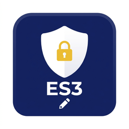

# 🛡 ES3 Save Editor

A fast, desktop-based save file editor for **Easy Save 3 (ES3)** Unity games.

This editor safely handles ES3's AES-128-CBC encryption, GZip compression, and non-standard JSON structures (like integer and object keys) that normally crash standard text editors or JSON parsers.



## Features

- ** Automatic Decryption/Encryption**: Fully supports AES-128-CBC and PBKDF2 key derivation. Just provide your game's save password.
- **GZip Support**: Automatically detects and handles GZip compression layers.
- **Smart Type-Aware Editing**: The editor reads the `__type` of every field and gives you the safest, easiest widget to edit it:
  - **Numbers** (`int`, `float`) get `＋/－` increment buttons.
  - **Booleans** get True/False radio toggles.
  - **Lists/Arrays** get a simple comma-separated editor.
  - **Custom Objects** are parsed into scrollable, editable tables.
- **🚦 Safety Indicators**: Fields are color-coded so you know exactly what is safe to touch:
  - 🟢 **Safe**: Basic data types. Edit freely!
  - 🟡 **Caution**: Dictionaries and Collections.
  - 🔴 **Advanced**: Complex custom game objects. Edits here have a raw text fallback.
- **Sortable Field List**: Click any column header (Field, Type, Value, S) to sort; click again to reverse.
- **Raw File View**: Inspect the full decrypted save text, copy it, or export it to `.json`/`.txt` (`Ctrl+R`).
- ** Auto-Backup & Restore**: Automatically creates a `.bak` copy of your save file the first time you hit save. Revert instantly via `File -> Restore Backup`.
- **Password Memory**: Securely remembers your file passwords and automatically reopens your last edited save file on startup (saved locally, never uploaded).

## Download & Installation

You don't need to install Python to use this editor.

1. Go to the [Releases](../../releases/latest) page.
2. Download the `ES3-Save-Editor.exe` file.
3. Run the executable.

## Building from Source

If you prefer to run from source or build the executable yourself:

1. Clone this repository.
2. Create a virtual environment and install the dependencies:
   ```bash
   pip install -r requirements.txt
   ```
3. Run the application:
   ```bash
   python main.py
   ```
4. To build the executable yourself via PyInstaller:
   ```bash
   pyinstaller --noconfirm --onefile --windowed --icon "icon.ico" --add-data "icon.ico;." --add-data "icon.png;." --name "ES3-Save-Editor" main.py
   ```
